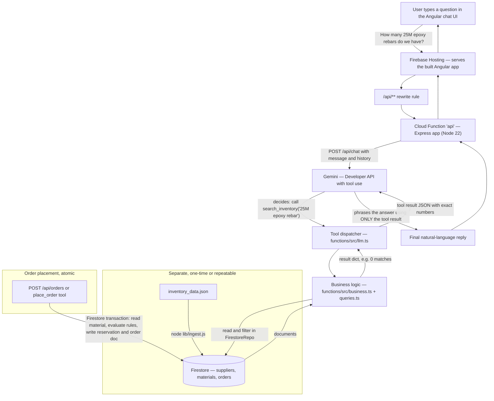

# Inventory Assistant (Angular + Firebase)

A chat assistant for a construction material supplier: checks stock, looks
up supplier terms, and places orders against a live inventory dataset.

**Live demo:** https://inventory-assistant-ed979.web.app

**Repo:** https://github.com/chenliyang1024/Inventory-Assistant

## API endpoints

The chat UI only calls `/api/chat` and `/api/admin/reset` — everything
below is a separate, direct REST surface over the same business logic, for
checking numbers without going through the LLM. All examples hit the live
demo.

| Method | Path | What it does |
|---|---|---|
| `GET` | `/api/materials?q=<query>&category=<category>` | Search the catalogue |
| `GET` | `/api/materials/:sku` | Look up one SKU, with derived availability |
| `GET` | `/api/suppliers/:supplierId` | Supplier payment terms and lead time |
| `POST` | `/api/orders` | Place an order — `{"sku": "...", "quantity": N}` |
| `POST` | `/api/chat` | Chat with the assistant — `{"message": "...", "history": []}` |
| `POST` | `/api/admin/reset` | Reload the catalogue from JSON, clear order history |
| `GET` | `/api/health` | `{"status": "ok"}` |

```bash
BASE=https://inventory-assistant-ed979.web.app

curl "$BASE/api/materials?q=rebar"
curl "$BASE/api/materials/STL-W12X40-A992"
curl "$BASE/api/suppliers/SUP-002"
curl -X POST "$BASE/api/orders" -H "Content-Type: application/json" \
  -d '{"sku":"STL-PL12-A36","quantity":2}'
```

## System flowchart



### The five required queries, traced through the system

1. **"Do we have any W12x40 beams available, and which warehouse are they in?"**
   `search_inventory("W12x40")` → `STL-W12X40-A992`, on_hand 4, reserved 6 →
   raw availability **-2** → reported as **0 available, over-allocated**, warehouse `YARD-1`.

2. **"How many 25M epoxy rebars do we have in stock?"**
   `search_inventory("25M epoxy rebar")` → **no exact match** (catalogue has
   15M-epoxy, 20M-epoxy, and a plain 25M — but not 25M-epoxy). The assistant
   says the SKU doesn't exist rather than substituting the closest one.

3. **"I want to order 500 lengths of 15M rebar. Can you fulfil that, and what would it cost?"**
   `check_stock("RBR-15M-400W")` → 120 available → `place_order(..., 500)` →
   **rejected, insufficient_stock**, states 120 is available, no partial fulfilment.

4. **"Can I order 3 sheets of 3/8 inch steel plate?"**
   `search_inventory` → `STL-PL38-A36`, 4 available but `discontinued: true`
   → `place_order` → **rejected, discontinued**, even though stock exists.

5. **"What are the payment terms and standard lead time for our rebar supplier, and how many 20M epoxy rebars can we ship today?"**
   `get_supplier_info(sku="RBR-20M-EPOXY")` → Grand River Rebar Ltd.,
   **NET30, 7-day lead time**. `check_stock("RBR-20M-EPOXY")` → on_hand 18,
   reserved 18 → **0 available today** (fully reserved, not negative).

## Project layout

```
firebase.json / firestore.rules / firestore.indexes.json   — Firebase config
functions/                — Cloud Functions (Node 22, TypeScript)
  src/
    types.ts                — shared types
    business.ts               — pure rule logic (availability, order evaluation) — unit tested
    queries.ts                  — repo-aware helpers (checkStock, searchMaterials, placeOrder, ...)
    repos/
      materialRepo.ts           — storage interface
      firestoreRepo.ts            — production implementation (transactional order placement)
      inMemoryRepo.ts               — test implementation
    llm.ts                          — Gemini tool-use integration (Gemini Developer API)
    ingest.ts                         — repeatable Firestore loader
    index.ts                           — Express app + Cloud Function export
  data/inventory_data.json
frontend/                  — Angular app (chat UI)
tests/run-tests.ts         — business logic tests (ts-node, no emulator needed)
```

## Setup

### 1. Install frontend dependencies

```bash
cd frontend
npm install
```

### 2. Point Firebase at your project

```bash
npm install -g firebase-tools
firebase login
firebase use --add
```

`firebase use --add` prompts you to pick a Firebase project and links it in
`.firebaserc`. `firebase.json`, `firestore.rules`, and
`firestore.indexes.json` are already configured for this project's
Firestore/Functions/Hosting layout — no `firebase init` needed.

If you're using your own Firebase project rather than the one already
linked, update the project ID in `frontend/proxy.conf.json`'s `target` to
match (`http://127.0.0.1:5001/YOUR_PROJECT_ID/us-central1/api`).

```bash
cd functions
npm install
npm run build
```

> **Verify the Hosting `public` path.** Angular's build output path has
> moved around across versions (`dist/<project>/browser` is current as of
> Angular 17+'s application builder). After your first `ng build`, check
> `frontend/dist/` and update `firebase.json`'s `hosting.public` to match
> exactly if it differs.

### 3. Get a Gemini API key and set it as a secret

The chat endpoint calls Gemini via the Gemini Developer API (API-key auth,
free tier — no Cloud Billing account or Vertex AI enablement required).
Generate a key at [Google AI Studio](https://aistudio.google.com/apikey),
then:

```bash
firebase functions:secrets:set GEMINI_API_KEY
```

For local emulator use, put the same key in `functions/.secret.local`
(gitignored) instead:

```
GEMINI_API_KEY=your-key-here
```

### 4. Ingest the data

Into the **real, deployed** Firestore (needed before/after `firebase deploy`):

```bash
cd functions
npm run build
gcloud auth application-default login   # once, if you haven't
node lib/ingest.js
```

Into the **local Firestore emulator** instead (for step 5 below — this does
_not_ touch real Firestore, and needs no `gcloud`/ADC at all):

```bash
cd functions
npm run build
FIRESTORE_EMULATOR_HOST=127.0.0.1:8080 GOOGLE_CLOUD_PROJECT=YOUR_PROJECT_ID node lib/ingest.js
```

Run this only while the emulators (step 5) are already running, since it
writes into the emulator's in-memory Firestore, which starts empty on every
`emulators:start` and isn't populated by the real-Firestore ingest above.

### 5. Run locally

The Firestore emulator requires **Java 21+** (`java -version`). If you're on
an older JDK, install one (e.g. `brew install openjdk@21` on macOS) and put
it on `PATH` for the emulator command, since Java 17 and earlier fail to
start it.

```bash
firebase emulators:start --only functions,firestore,hosting
# in another terminal, after ingesting into the emulator (step 4):
cd frontend && ng serve --proxy-config proxy.conf.json
```

### 6. Deploy

```bash
firebase deploy
```

## Tests

The business rules (the part that actually needs to be correct) are unit
tested without needing Firestore or an emulator — an in-memory repo backs
the same rule-evaluation code the Firestore repo uses:

```bash
npx ts-node tests/run-tests.ts
```

19 tests, run against the real `inventory_data.json`, covering the
over-allocated SKU, the non-existent 25M-epoxy rebar, the discontinued
steel plate, insufficient-stock rejection, and the rebar supplier lookup —
i.e., all five required queries plus the edge cases they're built around.

## Database schema and why it's shaped this way

Three Firestore collections: `suppliers` (doc ID = `supplier_id`),
`materials` (doc ID = `sku`), `orders` (auto-ID, append-only).

- **`qty_available` is never stored** — it's computed on every read
  (`computeAvailability` in `business.ts`). Storing a derived value invites
  it to drift from its inputs; computing it on read means it's always
  correct by construction.
- **`orders` never touches `qty_on_hand`.** Placing an order increments
  `qty_reserved` on the material doc and adds an audit-trail order doc.
  Shipment (which would decrement `qty_on_hand`) is out of scope per the
  spec.
- **Firestore, not SQL.** Given the deploy target is Firebase Hosting +
  Functions, Firestore is the natural fit — no separate DB to provision,
  and its transactions give real atomicity for order placement (see below),
  which a naive SQLite setup wouldn't have gotten for free.
- **Doc-per-SKU, not one big document.** 77 small documents is well within
  Firestore's comfort zone and lets `getMaterial(sku)` be a single
  point-read instead of fetching and filtering a blob.

### Search, and the tradeoff behind it

Firestore doesn't support substring/`LIKE` queries natively. At 77 SKUs,
the pragmatic choice is to read the whole `materials` collection once
(cached per warm function instance for 60s) and filter in JS
(`materialMatchesQuery` in `business.ts`) — the same tradeoff as `LIKE`
matching would have been in SQL, just implemented client-side of the query
rather than in it. This is the first thing to replace as the catalogue
grows (see "what breaks first" below).

## Business rules implemented

All seven rules from the spec, covered by `tests/run-tests.ts` against the
real dataset:

1. Availability computed as `qty_on_hand - qty_reserved`, never stored.
2. Placing an order increments `qty_reserved` only; `qty_on_hand` untouched.
3. Orders exceeding `qty_available` are rejected outright — no partial fulfilment.
4. Discontinued items are rejected even when stock remains (checked before
   the stock check — a discontinued+zero-stock item reports as
   discontinued, not as out of stock).
5. Unknown SKUs are never matched to the nearest-sounding item.
6. `min_order_qty` is not enforced on customer orders (it's a restocking
   minimum toward the supplier).
7. Line total is `unit_price × quantity`, no tax/discount.

### Over-allocated stock: how it's presented

`STL-W12X40-A992` (4 on hand, 6 reserved) has negative true availability.
The internal value (`qty_available_raw`, `-2`) is retained for
reconciliation, but the user-facing `qty_available` is floored at 0 with an
`over_allocated: true` flag. The chat system prompt requires the model to
say an item is over-allocated rather than silently reporting "0 available,"
since that would look identical to a merely fully-reserved item — a
meaningfully different situation for a warehouse worker.

## Assumptions made where the spec was silent

- **Search matching**: loose substring matching across SKU, description,
  category, and spec grade (all terms must match, case-insensitive), with a
  simple trailing-"s" plural/singular tolerance (e.g. "beams" matches
  catalogue text containing "beam") — added after the LLM's own search
  terms hit this exact mismatch in testing. No other fuzzy/typo tolerance.
- **Currency**: dataset is already CAD; no conversion added.
- **Order identity**: no customer/user identity attached to an order — the
  spec doesn't describe multiple customers or auth.
- **"Ship today"** (query 5): interpreted as "available right now"
  (`qty_available`), since shipment logistics from stock are out of scope.
- **Supplier lookup by category** ("our rebar supplier"): resolved via the
  specific SKU the question is about (all rebar SKUs here share one
  supplier), not a separate category→supplier mapping — a coincidence of
  this dataset, not a general rule (see below).

## Architecture

Angular (static build) on Firebase Hosting, talking to a single Express app
deployed as one Cloud Function (`api`), backed by Firestore. Hosting
rewrites route `/api/**` to the function so the frontend never needs to
know the function's actual URL. One Express app behind one function (not
one Cloud Function per route) means one cold start covers the whole API
surface rather than paying it per endpoint.

Angular + Firebase specifically because that toolchain was already set up
and working locally — no new environment to configure for a time-boxed
assignment, and Firebase Hosting + Functions + Firestore covers static
hosting, the API, and a persistent database from one deploy target instead
of assembling separate services.

### LLM / application-code boundary

The LLM only does two things: **picks which deterministic tool to call and
with what arguments**, and **phrases the final sentence using the tool's
returned JSON**. It never computes availability, never decides whether an
order is valid, and never sees the raw catalogue — that's ruled out by the
requirement that every number come from the database, not from an LLM
reasoning freely over inlined JSON. That logic lives entirely in
`business.ts`/`queries.ts` — plain TypeScript, no LLM awareness, unit
tested directly against the real dataset via an in-memory repo. The
Firestore-backed repo implements the exact same interface, so the rule
logic is identical in tests and in production; only the storage mechanics
differ.

Order placement gets one more layer: `evaluateOrder` (the rule check) is
re-run _inside_ the Firestore transaction against freshly-read data, so two
concurrent orders racing for the same last unit can't both succeed.

## Known limitations

1. **Search quality.** Loading the whole collection and filtering in JS
   works at 77 SKUs but won't scale past a few thousand, or once query
   phrasing gets messier than "the term is literally in the description."
   Algolia/Typesense (common Firestore pairings) or precomputed search
   tokens are the fix once the catalogue grows.
2. **The category→supplier assumption.** This dataset happens to have one
   supplier per category, so resolving "our rebar supplier" via the SKU
   works. A real catalogue with multiple suppliers per category would need
   an explicit default-supplier concept instead.
3. **The bounded tool-use loop** (capped at 6 round-trips) could time out
   on genuinely multi-step questions ("compare lead times across every
   supplier and rank them") — built for the five required queries, not
   open-ended multi-entity analysis.
4. **No conversation persistence server-side** — history round-trips from
   the client each request. Fine for one session, loses context on refresh.
5. **Cold starts** on the Cloud Function under bursty traffic; a min-instance
   setting would fix latency at the cost of always-on billing.

## Possible future improvements

- Real search (Algolia/Typesense) instead of full-collection JS filtering.
- A proper category→default-supplier concept instead of the SKU-based
  coincidence this dataset allows.
- Streaming chat responses so the UI doesn't wait for the full reply.
- Auth + per-customer order history.
- Integration tests hitting a live Firestore emulator + a live (but
  mocked) Gemini call, rather than stopping at the tool-dispatcher
  boundary as the current tests do.
- A reorder-point report: SKUs at or below `reorder_point` given current
  derived availability.
