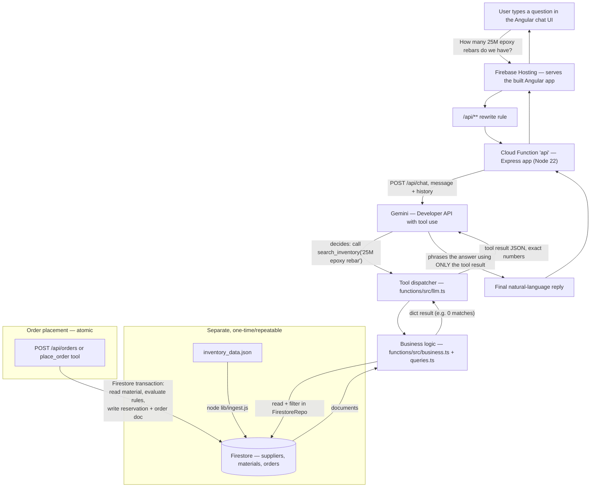

# System flowchart

## The five required queries, traced through the system

1. **"Do we have any W12x40 beams available, and which warehouse are they in?"**
   `search_inventory("W12x40")` → `STL-W12X40-A992`, on_hand 4, reserved 6 →
   raw availability **-2** → reported as **0 available, over-allocated**, warehouse `YARD-1`.

2. **"How many 25M epoxy rebars do we have in stock?"**
   `search_inventory("25M epoxy rebar")` → **no exact match** (catalogue has
   15M-epoxy, 20M-epoxy, and a plain 25M — but not 25M-epoxy). The assistant
   says the SKU doesn't exist rather than substituting the closest one.

3. **"I want to order 500 lengths of 15M rebar. Can you fulfil that, and what would it cost?"**
   `check_stock("RBR-15M-400W")` → 120 available → `place_order(..., 500)` →
   **rejected, insufficient_stock**, states 120 is available, no partial fulfilment.

4. **"Can I order 3 sheets of 3/8 inch steel plate?"**
   `search_inventory` → `STL-PL38-A36`, 4 available but `discontinued: true`
   → `place_order` → **rejected, discontinued**, even though stock exists.

5. **"What are the payment terms and standard lead time for our rebar supplier, and how many 20M epoxy rebars can we ship today?"**
   `get_supplier_info(sku="RBR-20M-EPOXY")` → Grand River Rebar Ltd.,
   **NET30, 7-day lead time**. `check_stock("RBR-20M-EPOXY")` → on_hand 18,
   reserved 18 → **0 available today** (fully reserved, not negative).
